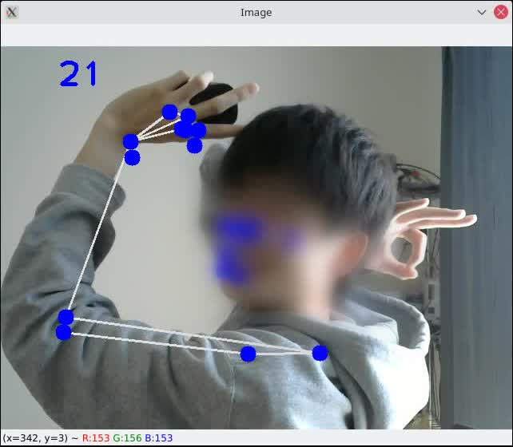

# pose estimation sandbox

[mediapipe](https://github.com/google/mediapipe) と [opencv-python](https://github.com/opencv/opencv-python) (Pre-built CPU-only OpenCV packages for Python) で Pose estimation の実験．

## Installation

動作確認は

- zsh 5.8
- Python 3.9.7
- pip 21.2.3

で行った．Arch Linuxを使用した．

```bash
python -m venv .venv # python -> python3である前提
source .venv/bin/activate # Windowsの場合はScripts以下の.batや.ps1などを指定
pip install -r requirements.txt
python pose_module.py
```

## Note

2021-11-01現在， opencv-python の issue [#572](https://github.com/opencv/opencv-python/issues/572) として報告されている症状が手元でも出たため少し古いバージョンを指定して使っている．治ったら最新版を使いたい．

## Sample

|||
---|:---:
sample1|
sample2|

左上の数字はフレームレート．

## References

- [MediaPipe](https://google.github.io/mediapipe/)
- [Latest Pose Estimation Realtime (24 FPS) using CPU | Computer Vision | OpenCV Python 2021](https://youtu.be/brwgBf6VB0I) (参考にした動画)
